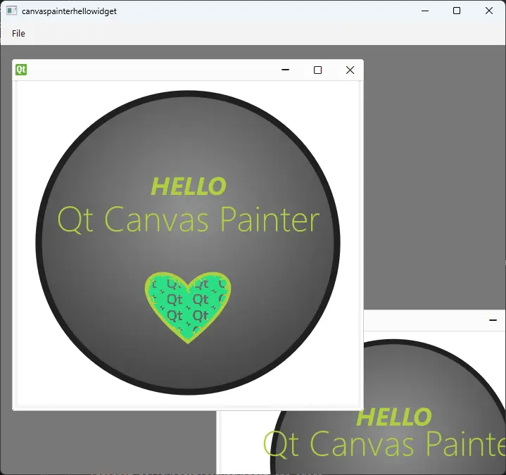

Qt Canvas Painter - Hello Widget Example
========================================

The example demonstrates the use of
:class:`~PySide6.QtCanvasPainter.QCPainter`
and :class:`~PySide6.QtCanvasPainter.QCPainterWidget`

The example implements a ``QCPainterWidget`` subclass. One or more instances
of this widget can then be added into a :class:`~PySide6.QtWidgets.QMdiArea`
inside the :class:`~PySide6.QtWidgets.QMainWindow`.
``QCPainterWidget`` itself derives from
:class:`~PySide6.QtWidgets.QRhiWidget`, and is always using accelerated 3D
rendering via :class:`~PySide6.QtGui.QRhi`.

Subclasses of ``QCPainterWidget`` will at minimum want to implement
:meth:`~PySide6.QtCanvasPainter.QCPainterWidget.paint`. This example
also uses an image, loaded from a ``PNG`` file.

The ``paint()`` function can start drawing using the provider ``QCPainter``
right away.

See :class:`~PySide6.QtCanvasPainter.QCPainter`,
:class:`~PySide6.QtCanvasPainter.QCBrush`,
:class:`~PySide6.QtCanvasPainter.QCRadialGradient`,
:class:`~PySide6.QtCanvasPainter.QCImagePattern`,
:class:`~PySide6.QtCanvasPainter.QCImage` and
:class:`~PySide6.QtGui.QFont` for more information on the features used by
this example.

The image is used as a pattern, for filling the heart shape.

When resources like ``QCImage`` and
:class:`~PySide6.QtCanvasPainter.QCOffscreenCanvas` and
are involved, these are
managed in ``QCPainterWidget.initializeResources()`` and
``QCPainterWidget.graphicsResourcesInvalidated()``.

``initializeResources()`` is merely a convenience. Instead of implementing it,
one could also write the following in paint():

.. code-block:: python

     if self.m_image.isNull():
         self.m_image = p.addImage(QImage(":/qt-translucent.png"),
                                   QCPainter.ImageFlag.Repeat)

This example does not reparent widgets between windows, so graphics resources
are not going to be lost. It is nonetheless a good pattern to assign a default,
empty object to all ``QCImage`` and ``QCOffscreenCanvas`` variables in
``graphicsResourcesInvalidated()``.

The main() function creates a ``QMainWindow`` and a ``QMdiArea``. Multiple
instances of the ``CanvasWidget`` class can be added as sub-windows. Due to
``QCPainterWidget.hasSharedPainter()`` defaulting to true, and due to being
placed within the same top-level widget, all the painter widgets will share the
same ``QCPainter`` and the associated rendering infrastructure, instead of
creating dedicated ones.

