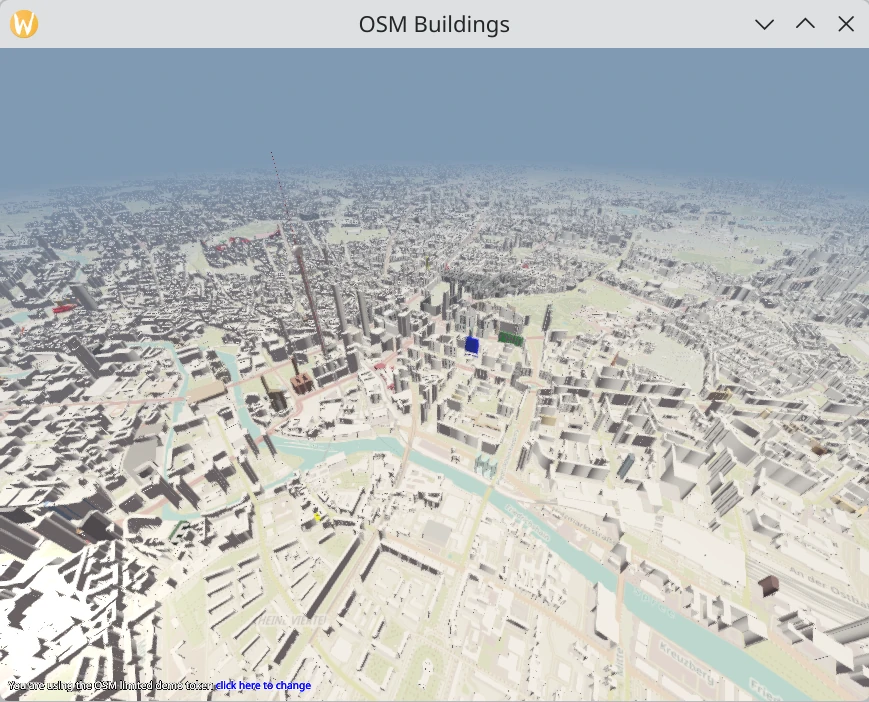

OSM Buildings
=============

This application shows a map obtained from `OpenStreetMap (OSM)`_  servers or a
locally limited data set when the server is unavailable using
:mod:`Qt Quick 3D <PySide6.QtQuick3D>`.

It is a port of the equivalent `C++ demo`_.

It requires the `mapbox_earcut`_ Python module to be installed::

    pip install -r requirements.txt

Controls
--------

When you run the application, use the following controls for navigation.

+---------+---------------------------+---------+
|         | Windows                   | Android |
+---------+---------------------------+---------+
| Pan     | Left mouse button + drag  | Drag    |
+---------+---------------------------+---------+
| Zoom    | Mouse wheel               | Pinch   |
+---------+---------------------------+---------+
| Rotate  | Right mouse button + drag | n/a     |
+---------+---------------------------+---------+

Fetching and parsing data
-------------------------

A custom request handler class (class ``OSMRequest``) is implemented for
fetching the data from the OSM map servers. It uses queues to handle concurrent
requests to boost up the loading process of maps and building data .

The application parses the online building JSON data and converts it to a list
of keys and values in geo formats such as
:class:`~PySide6.QtPositioning.QGeoPolygon` (see class ``OSMGeometry``).

It is then sent to a custom geometry item to convert the geo coordinates
to 3D coordinates.

The required data for the index and vertex buffers, such as position, normals,
tangents, and UV coordinates, is generated.

The downloaded ``PNG`` map data is sent to a custom
:class:`~PySide6.QtQuick3D.QQuick3DTextureData` item to convert the ``PNG``
format to a texture for map tiles.

The application uses camera position, orientation, zoom level, and tilt to find
the nearest tiles in the view (see ``OSMManager.setCameraProperties()``).

Rendering
---------

Every chunk of the map tile consists of a QML model (the 3D geometry) and a
custom material which uses a rectangle as a base to render the tilemap texture.

The application uses a custom geometry to render tile buildings.

To render building parts such as rooftops with one draw call,
a custom shader is used.

.. _`C++ demo`: https://doc.qt.io/qt-6/qtdoc-demos-osmbuildings-example.html
.. _`OpenStreetMap (OSM)`: https://www.openstreetmap.org/
.. _`mapbox_earcut`: https://pypi.org/project/mapbox-earcut/
