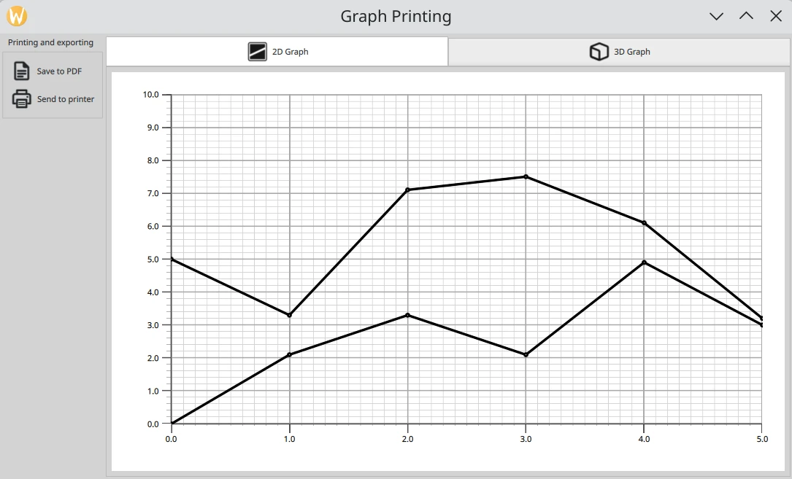

Graph Printing Example
======================

The Graph Printing example demonstrates how to print or export to PDF 2D and
3D graphs.

The printing functionality is implemented in the `GraphPrinter` class whose
slots are invoked from QML, passing an image obtained from
`QuickItem.grabToImage()`_ . The image is scaled and painted onto either
a :class:`~PySide6.QtPrintSupport.QPrinter` or a
:class:`~PySide6.QtGui.QPdfWriter`, which inherit
:class:`~PySide6.QtGui.QPaintDevice`.

.. _`QuickItem.grabToImage()`: https://doc.qt.io/qt-6/qquickitem.html#grabToImage
