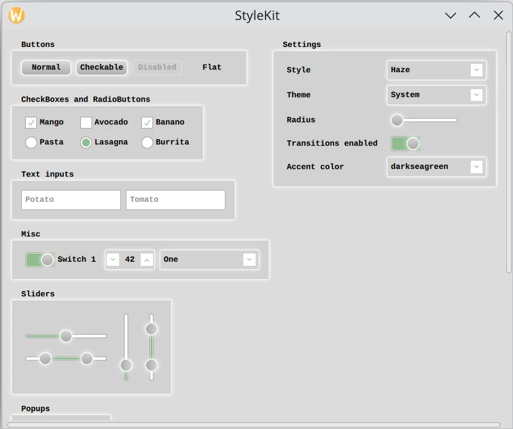

Qt Quick Controls - StyleKit
============================

A PySide6 application that demonstrates the analogous example in Qt
`StyleKit Example`_.

This example shows how to style `Qt Quick Controls`_ applications using
`Qt Labs StyleKit`_\.

It includes several styles that each demonstrate different aspects of styling:

* ``Plain`` - A minimal style with only the basics
* ``Haze`` - An advanced style with multiple themes
* ``Vitrum`` - A style targeting VR environments
* ``CustomDelegates`` - A style demonstrating how to create overlays, underlays, and
  shader effects

The example demonstrates, among other things, how to:

* Implement and switch between different styles.
* Implement support for light and dark themes, as well as additional themes such as high-contrast.
* Use `StyleVariation`_ to provide alternative styling for parts of the application.
* Implement custom delegates to add overlay and underlay effects.
* Apply shader-based visual effects to the controls.
* Build custom controls using `CustomControl`_ and `StyleReader`_\.
* Interact with a style at runtime, for example to change the theme or adjust style
  properties like the background radius.

.. _`StyleKit Example`: https://doc.qt.io/qt-6/qtlabsstylekit-stylekit-example.html
.. _`Qt Quick Controls`: https://doc.qt.io/qt-6/qtquickcontrols-index.html
.. _`Qt Labs StyleKit`: https://doc.qt.io/qt-6/qtlabsstylekit-index.html
.. _StyleVariation: https://doc.qt.io/qt-6/qml-qt-labs-stylekit-stylevariation.html
.. _CustomControl: https://doc.qt.io/qt-6/qml-qt-labs-stylekit-customcontrol.html
.. _StyleReader: https://doc.qt.io/qt-6/qml-qt-labs-stylekit-stylereader.html
