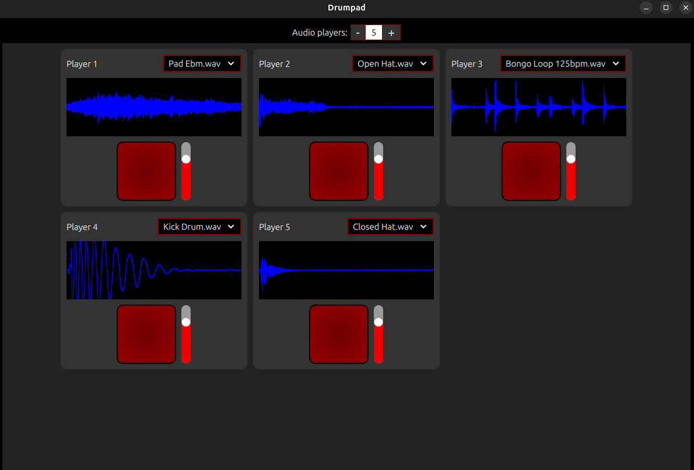
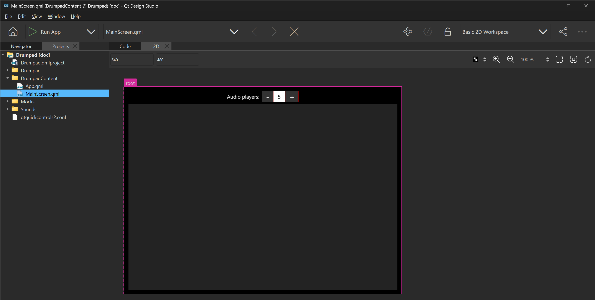
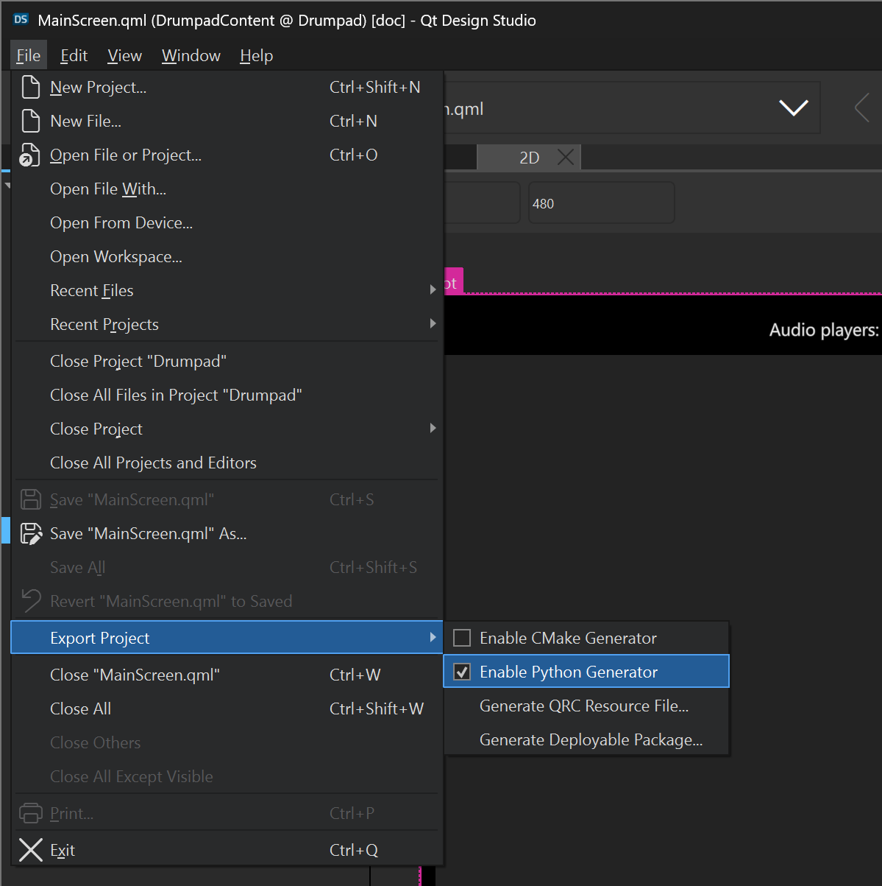

(tutorial_qt_design_studio_integration)=

# Qt Design Studio integration tutorial

## Summary

This tutorial provides a step-by-step guide for exporting a [Qt Design Studio] project for Python
development and deployment. You will learn how to:

 - Export a Qt Design Studio in order to get a project template for further Python development
 - Implement custom QML elements using Python
 - Successfully deploy the PySide6 application

```{note}
This tutorial is not focused on teaching how to use Qt Design Studio or QML, but rather how to
integrate PySide6 with an existing Qt Design Studio project. If you want to learn how to use Qt
Design Studio, check the [available tutorials][qt-design-studio-tutorials].
```

The project consists in a single "drumpad" screen that can be used to play different sound effects.
The screen is composed of a responsive grid of buttons, each playing a different sound. In addition,
a waveform display shows the audio amplitude over time using [Qt Multimedia] features.



## Workflow overview

Before starting the tutorial, we need to understand the Qt Design Studio project workflow first.

1. **Create a QML project using Qt Design Studio**: Develop the application UI in a user
friendly way. You can visually design components, screens and animations without writing QML code
manually.

2. **Export the project**: Create a Python project using the Qt Design Studio generator.

3. **Develop logic**: Implement custom functionalities and application logic in Python, connecting
it to the exported QML files. Define *backend* elements and signal communication with the UI.

4. **Deploy**: Package the application into a standalone executable using the [pyside6-deploy] tool.
This bundles all required dependencies, resources, and modules into a distributable format.

## Qt Design Studio project set up

The initial project source code is available for download at {ref}`example_tutorials_drumpad_initial_project`.
This provides the starting point for the tutorial and includes a set of QML files, Qt Resource
files, and other project files.



Qt Design Studio offers a Python project template generator. The option can be enabled in the
`File` > `Export project` > `Enable Python Generator` setting.



When the setting is enabled, Qt Design Studio will create a `Python` folder in the project directory,
containing the `main.py` and `pyproject.toml` files as well as the `autogen` folder. The `autogen`
folder contains the `settings.py` file, which is used to set up the project root path, the QML
import paths and other Qt specific settings.

## Python development

The project contains three Python files that define QML elements located in the `Python/audio`
folder. They belong to the `Audio` QML module. The QML code expects that they exist. Otherwise, the
application can not be executed.

The `AudioEngine` QML element is responsible for playing audio files. It uses the `QSoundEffect`
class from the [Qt Multimedia] module to play the audio files. It also provides [Qt Signals] for
communicating with the QML layer.

<details>
<summary class="prominent-summary">audio_engine.py</summary>

```{literalinclude} ../../../../../../../../examples/tutorials/drumpad/final_project/Python/audio/audio_engine.py
---
language: python
caption: audio_engine.py
linenos: true
---
```
</details>

The `AudioFilesModel` QML element is responsible for managing the audio files. It fetches the
available audio files from the `Sounds` folder and provides a `getModel()` method to return a list
of files. It detects whether the application has been deployed because the compiled Qt resource
files are used in this case.

<details>
<summary class="prominent-summary">audio_files_model.py</summary>

```{literalinclude} ../../../../../../../../examples/tutorials/drumpad/final_project/Python/audio/audio_files_model.py
---
language: python
caption: audio_files_model.py
linenos: true
---
```
</details>

The `WaveformItem` QML element is responsible for displaying the audio waveform. It uses the
`QAudioDecoder` and `QAudioFormat` classes from the [Qt Multimedia] module to decode the audio file
and display the waveform. The graph is drawn using [QPainter].

<details>
<summary class="prominent-summary">waveform_item.py</summary>

```{literalinclude} ../../../../../../../../examples/tutorials/drumpad/final_project/Python/audio/waveform_item.py
---
language: python
caption: waveform_item.py
linenos: true
---
```
</details>

## Running the application

Navigate to the `Python/` directory of the project:

```bash
cd Python/
```

Then, build the project using:

```bash
pyside6-project build
```

This command will compile resources, UI files, QML files, and other necessary components.

## Deployment

In order to create a standalone executable of the application, we can use the [pyside6-deploy]
command line tool. It will analyze the project source code, determine the required Qt modules and
dependencies and bundle the code into a native executable.

To deploy the application, execute the following command from the `Python/` directory:

```bash
pyside6-deploy --name Drumpad
```

This will create a standalone executable for the application in the project directory.

```{important}
Make sure to fulfil the [pyside6-deploy requirements] for your platform. Otherwise, the tool will
not detect that the example code uses Qt Multimedia module. In that case, the produced
executable will not work properly.
```

### Qt resource files

Note that since the `main.py` file is contained in the `Python` folder, its references to the project
QML files and other resources have to traverse one level up. When the project is deployed, this is
an issue because of the way [Nuitka] works. After the deployment, the `main.py` entry point file
is morphed into a native executable file, but its location in the project folder changes:

Project structure before deployment:
```
├── Drumpad
│   ├── AvailableSoundsComboBox.qml
│   ...
├── Python
│   ├── main.py
│   ├── pyproject.toml
│   └── autogen
└── Sounds
    ├── Clap.wav
    ├── Kick Drum.wav
    ...
```

Project structure after deployment:
```
├── main.exe  (OS dependent executable format)
├── Drumpad
│   ├── AvailableSoundsComboBox.qml
│   ...
└── Sounds
    ├── Clap.wav
    ├── Kick Drum.wav
    ...
```

The relative location of the resources changes after the deployment. For example, before deploying
the application, the path for accessing a sound from the `main.py` file would be:
`../Sounds/Clap.wav`. After the deployment, the relative path is now: `Sounds/Clap.wav`.

This issue is addressed by the [pyside6-deploy] tool thanks to the usage of
[Qt resource files][Qt Resource System]. All the files listed in the `Drumpad.qrc` file are embedded
in the executable and can be accessed by importing the `Python/autogen/resources.py` Python file.
This way, the paths can be easily resolved properly after the deployment of the application.

Qt Design Studio creates the `Python/autogen/settings.py` file which contains code that enables the
usage of the compiled Qt resources when the application is deployed. This code can be modified on
demand.

## Conclusion

In this tutorial, you learned how to integrate a user interface developed in [Qt Design Studio] with
a Python *backend* using PySide6. We walked through the complete workflow, from exporting a QML
project and implementing custom Python logic to packaging the application into a standalone
executable using [pyside6-deploy].

[Qt Design Studio]: https://www.qt.io/product/ui-design-tools/
[Qt Quick]: https://doc.qt.io/qt-6/qtquick-index.html
[qt-design-studio-tutorials]: https://doc.qt.io/qtdesignstudio/gstutorials.html
[Qt Multimedia]: https://doc.qt.io/qt-6/qtmultimedia-index.html
[Nuitka]: https://nuitka.net/
[Qt Resource System]: https://doc.qt.io/qt-6/resources.html
[pyside6-deploy]: https://doc.qt.io/qtforpython-6/deployment/deployment-pyside6-deploy.html
[pyside6-deploy requirements]: https://doc.qt.io/qtforpython-6/deployment/deployment-pyside6-deploy.html#considerations
[QML module]: https://doc.qt.io/qt-6/qtqml-modules-topic.html
[Qt Signals]: https://doc.qt.io/qt-6/signalsandslots.html
[QPainter]: https://doc.qt.io/qt-6/qpainter.html
